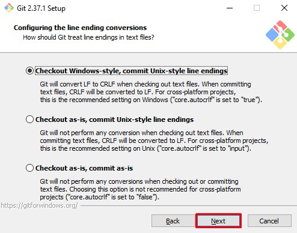

Instructions for installing git on Windows. Written instructions are in the mousover text.

    

      

</img>

      

</img>

      

</img>

      

</img>

      

</img>

      

</img>

      

</img>

      

</img>

      

</img>

      

</img>

      

</img>

      

</img>

      

</img>

      

</img>

      

</img>

      

</img>

      

</img>

      

</img>

      

</img>

    

